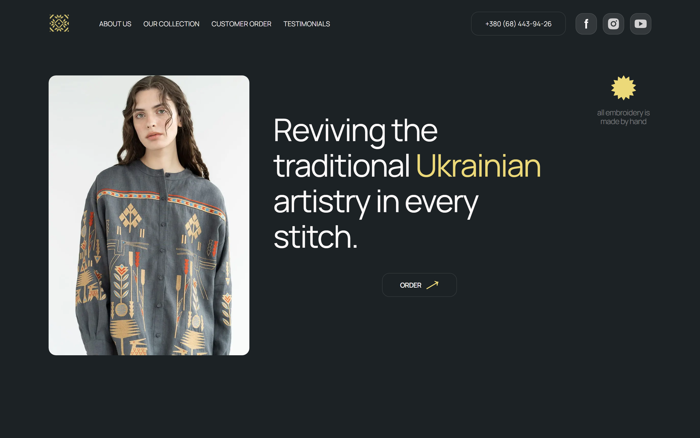
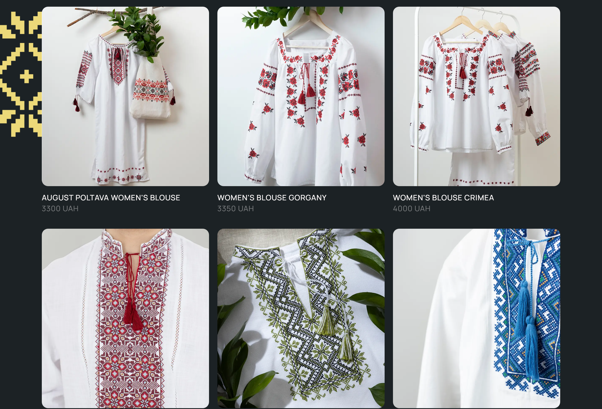
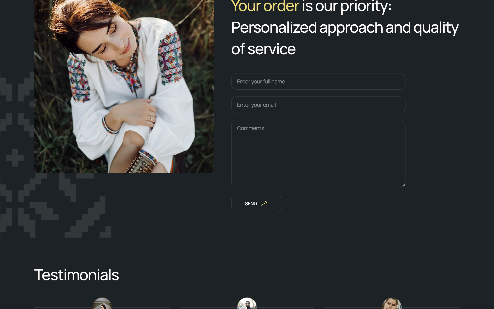
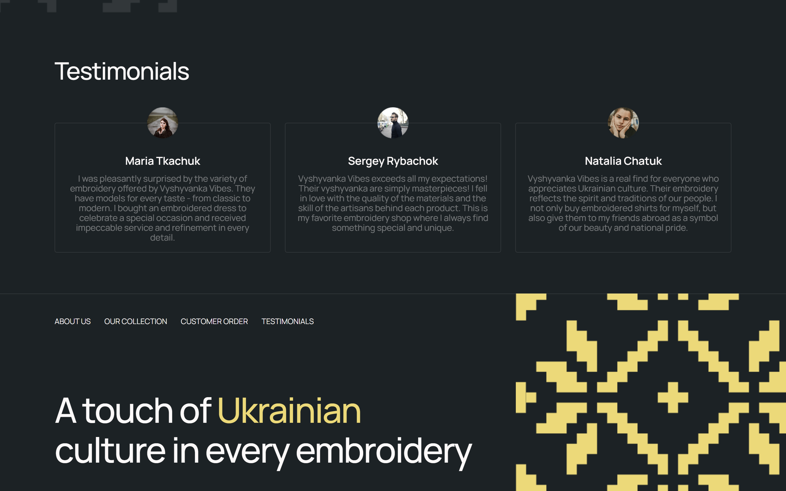
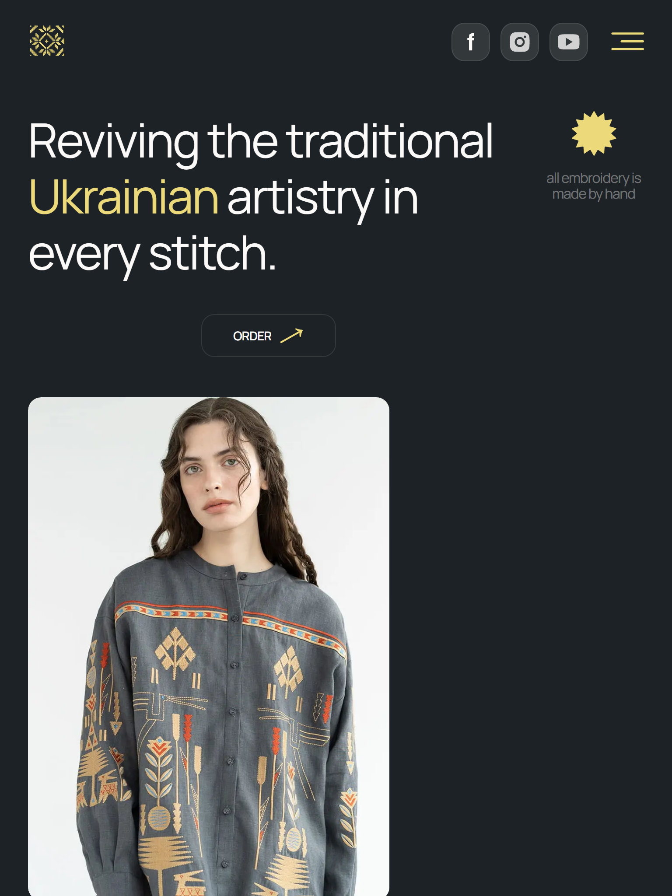
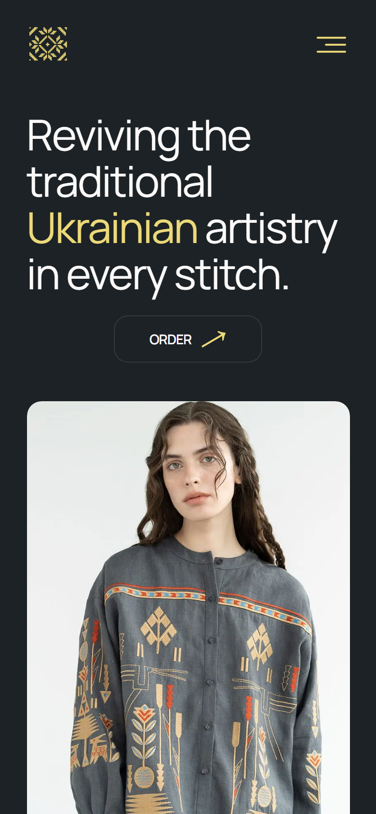
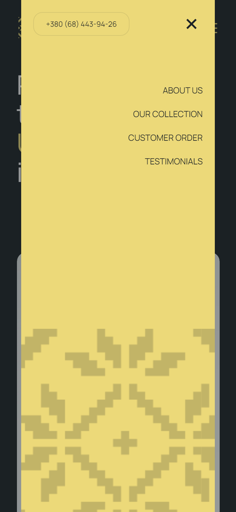

# Vyshyvanka Vibes

<p align="center">
  
</p>

<p align="center">
  <strong>Лендінг магазину традиційної української вишиванки</strong>
</p>

<p align="center">
  
  
  
  
  
</p>

<p align="center">
  <a href="https://tony-kobs.github.io/VyshyvankaVibes-project/"><strong>Live Demo</strong></a>
  ·
  <a href="https://github.com/tony-kobs/VyshyvankaVibes-project">Repository</a>
  ·
  <a href="https://github.com/tony-kobs">Antony Kobys</a>
</p>

<p align="center">
  
</p>

---

## Про проєкт

Це **мій другий соло pet-project**.

Першим була [WebStudio](https://github.com/tony-kobs/webstudio) — односторінковий сайт компанії. Тут я пішов далі: адаптивний лендінг магазину вишиванок з анімаціями, мобільним меню, формою замовлення та окремими станами для mobile / tablet / desktop.

**Vyshyvanka Vibes** — вигаданий магазин handmade-вишиванки. Сторінка розповідає про бренд, показує колекцію, приймає замовлення й збирає відгуки.

| | |
| --- | --- |
| **Автор** | [Antony Kobys](https://github.com/tony-kobs) |
| **Тип** | 2nd solo pet-project |
| **Попередній** | [WebStudio](https://tony-kobs.github.io/webstudio/) |
| **Стек** | HTML5, CSS3, vanilla JavaScript, Vite |
| **Деплой** | GitHub Pages |

---

## Скріни

### Колекція

<p align="center">
  
</p>

### Форма замовлення

<p align="center">
  
</p>

### Відгуки та футер

<p align="center">
  
</p>

### Адаптив

<p align="center">
  
  &nbsp;
  
  &nbsp;
  
</p>

<p align="center"><sub>Планшет · Мобільний · Меню</sub></p>

---

## Що вміє сайт

- Адаптивна верстка: **320 / 768 / 1280 / 1440**
- Hero, about, колекція, форма замовлення, testimonials, footer
- Мобільне меню з оверлеєм, Escape, lock скролу та `aria`-атрибутами
- Плавна поява секцій під час скролу (`IntersectionObserver`)
- Ротація фото на десктопі
- Форма з валідацією та повідомленням після відправки
- WebP-зображення, preload для LCP, `prefers-reduced-motion`

---

## Технології

```text
HTML5  ·  CSS3 (mobile-first)  ·  JavaScript (ES modules)  ·  Vite 7
```

- Семантична розмітка й partials через `vite-plugin-html-inject`
- CSS-змінні, окремі файли стилів на секцію
- Vanilla JS без фреймворків: меню, скрол-анімації, ротатор, форма

---

## Запуск локально

```bash
git clone https://github.com/tony-kobs/VyshyvankaVibes-project.git
cd VyshyvankaVibes-project
npm install
npm run dev
```

Відкрий [http://localhost:5173/VyshyvankaVibes-project/](http://localhost:5173/VyshyvankaVibes-project/).

| Команда | Що робить |
| --- | --- |
| `npm run dev` | dev-сервер Vite |
| `npm run build` | продакшен-білд у `dist/` |
| `npm run preview` | прев’ю зібраного сайту |

---

## Структура

```text
src/
├── index.html          # точка входу
├── main.js
├── css/                # стилі секцій
├── js/                 # меню, анімації, форма, ротатор
├── partials/           # header, hero, about, collection, order, footer
├── img/                # webp, іконки, декоративні елементи
└── public/favicon.svg
```

---

<p align="center">
  Зроблено соло · Antony Kobys · 2026
</p>
